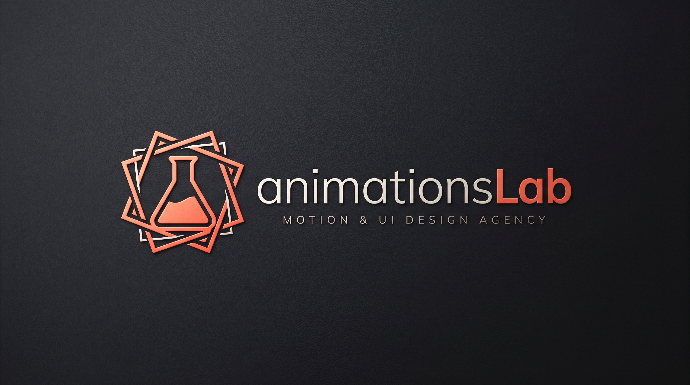

# 🚀 Animation Lab & Interactive Playground

<div align="center">




**A dual-platform interactive animation laboratory & sandbox for Web & Mobile.**  
Experience, live-tweak, and copy-paste buttery-smooth micro-interactions.

[Live Showcase](https://animations-lab.vercel.app) • [Component Catalog](#-component-catalog) • [Getting Started](#-getting-started) • [Contributing](#-contributing)

</div>

---

## 🌟 Features

- **🌐 Web (React + Framer Motion) & 📱 Mobile (React Native + Reanimated):**  
  Every component contains tailored implementations for both ecosystems side-by-side.
- **⚡ In-Browser "Try It Yourself" Sandbox:**  
  Powered by `@codesandbox/sandpack-react`. Tweak springs, stiffness, timing curves, and styling in the browser with hot-reload feedback. Zero local setup required.
- **📋 One-Click Copy-Paste Ready:**  
  Instant buttons to copy component code or terminal `npm`/`expo` installation commands.
- **🔍 Real-Time Catalog Filter & Search:**  
  Filter animations by category (Buttons, Toggles, Cards, Transitions) or search by tags and keywords instantly.
- **🌙 Sleek Dark Theme & Micro-Interactions:**  
  Designed with deep obsidian palettes, glassmorphism, glowing ambient accents, and micro-animations.

---

## 📦 Component Catalog

| Component | Category | Web Engine | Mobile Engine | Preview |
| :--- | :--- | :--- | :--- | :--- |
| **Magnetic Button** | Buttons | Framer Motion | Reanimated v3 + Gestures | Cursor / Touch Attraction |
| **Neon Shimmer Button** | Buttons | Conic Gradient CSS | Reanimated Pulse | Rotating Neon Border Glow |
| **Morphing Theme Switch** | Toggles | Framer Motion SVG | Reanimated Spring | Sun / Moon Layout Morph |
| **3D Perspective Tilt Card** | Cards | 3D Transform Motion | Reanimated Pan 3D | Dynamic 3D Angles & Glare |
| **Spring Bottom Sheet** | Transitions | Drag to Dismiss | Reanimated Bottom Sheet | Fluid Drawer Physics |

---

## 🛠️ Tech Stack

- **Framework:** [Next.js](https://nextjs.org/) 16 (App Router, Turbopack)
- **Language:** [TypeScript](https://www.typescriptlang.org/)
- **Styling:** [Tailwind CSS](https://tailwindcss.com/) v4 & Custom Keyframes
- **Web Animation:** [Framer Motion](https://www.framer.com/motion/)
- **Mobile Animation:** [React Native Reanimated](https://docs.swmansion.com/react-native-reanimated/) & [Expo Snack](https://snack.expo.dev/)
- **In-Browser Sandbox:** [@codesandbox/sandpack-react](https://sandpack.codesandbox.io/)
- **Icons:** [Lucide Icons](https://lucide.dev/)

---

## 🚀 Getting Started

### Prerequisites
- Node.js 18.17+ or 20+ (LTS)
- npm or pnpm

### Installation

```bash
# Clone the repository
git clone https://github.com/omercnkc/animations-lab.git

# Navigate to project folder
cd animations-lab

# Install dependencies
npm install

# Start development server
npm run dev
```

Visit `http://localhost:3000` in your browser.

---

## 🗺️ Adding a New Animation

To add a new animation to the catalog:

1. Create a new file in `src/registry/items/<category>/<component-name>.ts`.
2. Define both `webCode` and `mobileCode` following the `ComponentItem` schema.
3. Export it in `src/registry/index.ts`.
4. It will immediately appear in the catalog, search index, and dedicated sandbox playground page!

---

## 📄 License

MIT License © [omercnkc](https://github.com/omercnkc)
