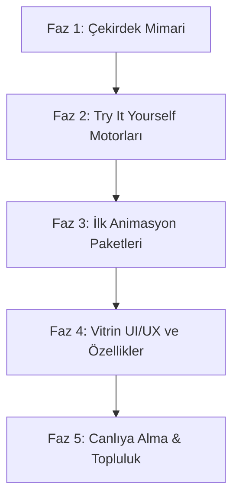

# 🚀 Animation Lab & Interactive Playground — Proje Yol Haritası (Roadmap)

Bu doküman, hem **Web** hem **Mobil (React Native)** animasyonlarını barındıran, kullanıcıların kodu tarayıcı üzerinden canlı olarak düzenleyip deneyimleyebileceği (**W3Schools tarzı "Try it Yourself"**) modern animasyon vitrini platformunun uçtan uca yol haritasıdır.

---

## 🎯 Proje Vizyonu
* **İki Platform Tek Çatı:** Her animasyonun hem modern Web (React / Framer Motion / CSS) hem de Mobil (React Native / Reanimated) sürümü bulunur.
* **Canlı Deneyim (Interactive Sandbox):** Kullanıcı bileşeni sadece video/gif olarak izlemez; tarayıcıda kodu anlık değiştirir, tıklar, sürükler ve test eder.
* **Kopyala-Kullan (Copy-Paste Ready):** Tek tıkla bağımlılıkları ve temiz kodu kopyalama imkanı.

---

## 🛠️ Teknoloji Yığını (Tech Stack) & Kullanım Amaçları

| Teknoloji | Kategori | Neden ve Ne İçin Kullanıyoruz? |
| :--- | :--- | :--- |
| **Next.js (App Router)** | Web Framework | Hızlı sayfa geçişleri, SEO uyumu, her bileşene özel URL oluşturma (`/components/buttons/magnetic-button`) ve statik render gücü için. |
| **Tailwind CSS + Vanilla CSS** | Stil & Arayüz | Vitrin arayüzünün modern, minimalist ve karanlık/aydınlık mod destekli olması için. Özel animasyon keyframe'leri için saf CSS. |
| **@codesandbox/sandpack-react** | Web Playground Motoru | **W3Schools mantığını Web için sağlayan çekirdek araç.** Tarayıcı içinde mini bir derleyici çalıştırır; sol panele kodu, sağ panele canlı çıktıyı koyar. Sıfır sunucu maliyeti! |
| **Expo Snack Embed** | Mobil Playground Motoru | **React Native kodlarını tarayıcıda canlı çalıştırmanın standart yolu.** Ziyaretçiye tarayıcı içinde interaktif bir iPhone/Android simülatörü sunar. |
| **Framer Motion** | Web Animasyon | Yay (spring) fizikleri, jestler (hover, tap, drag) ve yumuşak sayfa geçişleri için. |
| **React Native Reanimated (v3)** | Mobil Animasyon | 60-120 FPS'te doğrudan UI thread üzerinde çalışan pürüzsüz mobil animasyon kodları için. |
| **Lucide Icons** | İkon Seti | Modern, hafif ve tema uyumlu ikonlar (Güneş, Ay, Oklar, Kopyala butonu vb.). |
| **Vercel** | Dağıtım (Hosting) | GitHub reposuna her `git push` yapıldığında otomatik derleme ve ücretsiz global CDN yayını için. |

---

## 🗺️ Faz Faz Geliştirme Yol Haritası



---

### 📍 Faz 1: Çekirdek Mimari & Altyapı Kurulumu
- [ ] **Next.js & Tailwind Kurulumu:** Temiz, minimalist bir vitrin şablonunun ayağa kaldırılması.
- [ ] **Tasarım Sistemi:** Koyu tema (Dark Mode default) odaklı şık renk paleti, tipografi ve kart tasarımları.
- [ ] **Bileşen Veri Yapısı (Registry Schema):** Her bileşenin başlık, açıklama, kategori, web kodu ve mobil kodunu tutan JSON / TypeScript veri modeli.
- [ ] **Klasör Hiyerarşisi:**
  ```text
  showcase/
  ├── app/
  │   ├── (catalog)/[category]/[slug]/page.tsx   # Bileşen detay & playground sayfası
  │   └── page.tsx                               # Ana vitrin sayfası
  ├── components/
  │   ├── playground/                            # Sandpack & Expo Embed bileşenleri
  │   └── ui/                                    # Kartlar, navbar, filtreler
  └── registry/                                  # Animasyonların kaynak kodları
      ├── buttons/
      ├── toggles/
      └── transitions/
  ```

---

### 📍 Faz 2: "Try it Yourself" Motorlarının Entegrasyonu
- [ ] **Web Sandbox (Sandpack):**
  - Sol tarafta sözdizimi vurgulamalı kod editörü.
  - Sağ tarafta canlı yenilenen bileşen önizlemesi.
  - Kod düzenlendiğinde anında (hot-reload) yansıyan önizleme penceresi.
- [ ] **Mobil Sandbox (Expo Snack):**
  - React Native bileşenleri için Expo Snack iframe köprüsü.
  - Mobil cihazda anında test etmek için **QR Kod** modalı.
- [x] **Sekme Geçişi (Platform Switcher):**
  - Tek tıkla `[ 🌐 Web (React) ]` ve `[ 📱 Mobile (React Native) ]` modları arasında geçiş yapabilme.

---

### 📍 Faz 3: İlk Animasyon Katalogları (İçerik Üretimi)
- [x] **Tema Geçişleri (Theme Toggles):**
  - Smooth Morphing Sun/Moon Toggle (SVG morphing geçişi).
- [x] **Butonlar (Interactive Buttons):**
  - Magnetic Button (İmleci/parmağı çeken manyetik buton).
  - Shimmer / Border Glow Button (Modern neon ışıma efekti).
- [x] **Kartlar & 3D (Cards):**
  - 3D Perspective Tilt Card (Açısal eğim ve hologram yansıması).
- [x] **Sayfa & Modal Geçişleri (Transitions):**
  - Bottom Sheet Slide-Up (Mobilde ve webde pürüzsüz açılan alt panel).

---

### 📍 Faz 4: Kullanıcı Deneyimi & Vitrin Özellikleri
- [x] **Tek Tık Kopyalama:** Kod bloklarının üzerinde "Copy Code" ve "Copy Install Command" butonları.
- [x] **Filtreleme & Arama (Cmd + K):** Kategoriye göre (Butonlar, Kartlar, Geçişler) filtreleme ve gerçek zamanlı arama.
- [x] **Responsive Tasarım:** Sitenin kendisinin de mobilde ve tablette kusursuz çalışması.

---

### 📍 Faz 5: Canlıya Alma (Deploy), SEO ve GitHub Entegrasyonu
- [ ] **Vercel Entegrasyonu:** `animations-lab.vercel.app` üzerinden ücretsiz canlı yayın.
- [x] **OpenGraph & SEO:** Sayfa başlıkları, meta açıklamaları ve OpenGraph hazırlandı.
- [x] **GitHub README Entegrasyonu:** GitHub reposundan doğrudan web sitesine yönlendiren badge'ler ve kullanım kılavuzu.

---

## 💡 Yeni Bir Animasyon Eklerken İzlenecek Rutin (Workflow)

```text
1. Animasyonu Web (CSS/Framer) ve Mobil (Reanimated) olarak kodla.
2. Expo Snack'te test edip kaydederek Snack ID'sini al.
3. 'registry/' klasörüne kodları ekle.
4. Otomatik olarak hem web sitesindeki 'Try It' alanında hem de GitHub'da yayına girsin!
```

---
*Hazırlayan: Antigravity AI — animations-lab Workspace*
